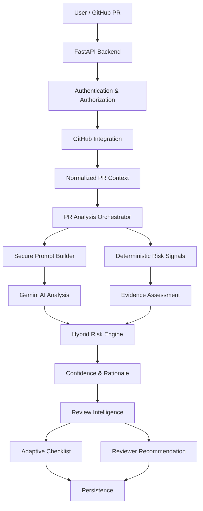

# GitReview AI – Chrome Extension for AI-Powered Pull Request Review Assistance

## Overview

GitReview AI is an AI-assisted pull-request review platform designed to help developers identify PR risk, understand the reasoning behind the assessment, and obtain actionable review guidance.

The repository contains the FastAPI backend and AI analysis pipeline, a Manifest V3 Chrome Extension (popup, dashboard, analytics, repository management), and a reusable GitHub Action. All of this is implemented and covered by automated tests that use mocks and an in-memory database. It has **not** yet been deployed or validated against live GitHub, Gemini, or Supabase services (see [Current Status](#current-status)).

## Problem Statement

Traditional PR review workflows can require reviewers to manually inspect large diffs, identify risky changes, determine appropriate reviewers, and construct review checklists.

GitReview AI aims to assist this workflow through a combination of:

* GitHub PR context
* deterministic code signals
* semantic AI analysis
* explainable risk assessment
* review intelligence

## Objectives

1. Context-Aware PR Integration
2. Secure Semantic PR Processing
3. Hybrid Explainable Risk Assessment
4. Actionable Review Intelligence

## Key Implemented Capabilities

### GitHub Integration

* GitHub authentication
* repository authorization
* pull-request retrieval
* PR analysis workflow

### AI Analysis

* Gemini-based semantic analysis (default model `gemini-2.5-flash`, configurable via `GEMINI_MODEL`)
* secure prompt construction
* validated AI output
* retry/validation behavior

### Deterministic Analysis

* Sensitive path detection and pattern matching
* Code ownership and test coverage signals
* Deterministic rule-based exclusions

### Hybrid Risk Assessment

Deterministic evidence and AI analysis are combined to produce a unified risk assessment. The system incorporates an evidence-based risk-tier behavior to categorize the pull request risk levels.

### Explainability

The system provides concrete rationale and evidence for its risk assessments, extracting context rather than only returning a risk label.

### Confidence

Confidence calculation is implemented using a hybrid scoring mechanism with a cold-start cap, evaluating the breadth of evidence available.

### Review Intelligence

* Reviewer recommendation (CODEOWNERS-weighted ranking, abstain-on-insufficient-evidence)
* Adaptive checklist (deterministic rules combined with AI signals)

### Chrome Extension

* Manifest V3 popup (React + TypeScript + Vite)
* GitHub OAuth sign-in through the backend
* Analysis view: risk tier, confidence, rationale, review focus areas, suggested reviewer, adaptive checklist
* Feedback on the risk tier and on the reviewer recommendation
* Checklist completion, persisted per reviewer via the backend
* Dashboard with individual and repository analytics, and repository authorization management

See [`extension/README.md`](extension/README.md) for setup and limitations.

### Backend API

* `GET /api/auth/login`
* `GET /api/auth/callback`
* `POST /api/auth/logout`
* `GET /api/auth/me`
* `GET /api/repositories`
* `POST /api/repositories/authorize`
* `DELETE /api/repositories/{repository_id}/access`
* `GET /api/repositories/{repository_id}/pulls`
* `GET /api/repositories/{repository_id}/pulls/{pull_number}`
* `POST /api/repositories/{repository_id}/pulls/{pull_number}/analyze`
* `POST /api/analyses/{analysis_id}/feedback`
* `PATCH /api/analyses/{analysis_id}/checklist/{item_id}`
* `GET /api/analytics/me`
* `GET /api/analytics/repositories/{repository_id}`
* `POST /api/actions/analyze`
* `GET /health`

## Architecture



## Technology Stack

### Backend

* Python
* FastAPI
* SQLAlchemy
* PostgreSQL

### AI

* Google Gemini
* AI provider abstraction/interface
* structured/validated AI output (Pydantic)

### Extension

* TypeScript, React, Vite (Manifest V3)

### Integration

* GitHub API
* GitHub OAuth
* GitHub Actions (composite action)

### Testing / Quality

* Pytest (backend), Vitest (extension)
* Ruff
* TypeScript type-checking (`tsc --noEmit`)

## Project Structure

```text
backend/
├── app/
│   ├── api/
│   ├── auth/
│   ├── ai_provider/
│   ├── analysis/
│   ├── core/
│   ├── feedback/
│   ├── github_integration/
│   ├── pull_requests/
│   └── repositories/
├── tests/
├── migrations/
├── pyproject.toml
├── alembic.ini
└── .env.example

extension/                # Chrome Extension (Manifest V3)
├── src/
├── public/               # manifest.json + icons
└── .env.example

.github/
├── actions/gitreview-ai/ # Reusable composite action + example workflow
└── workflows/            # Workflow for this repository
```

## Current Status

> **Backend, Chrome Extension, and GitHub Actions integration are implemented and covered by automated tests (mocked external services, in-memory database).**
>
> **Not yet done:** deployment, and end-to-end validation against live GitHub, Gemini, and Supabase. Passing automated tests and a passing production preflight show that the code and configuration are well-formed. They do not show that the system is deployed or production-validated.

## GitHub Actions Integration

### Overview

GitReview AI provides a reusable GitHub Action that automatically analyzes pull requests and posts a risk assessment comment. The action:

1. Calls the GitReview AI backend's `POST /api/actions/analyze` endpoint
2. Posts a formatted PR comment with risk tier, confidence, reviewer recommendation, and review checklist
3. Applies a risk-tier label (e.g. `risk: high`) to the PR

The action is **review assistance, not a merge gate** — it never blocks merges.

### Prerequisites

1. A deployed GitReview AI backend
2. At least one user has authorized the repository via the Chrome Extension
3. Two GitHub repository secrets configured:
   - `GITREVIEW_BACKEND_URL` — Full URL of the backend (e.g. `https://your-app.onrender.com`)
   - `GITREVIEW_SHARED_SECRET` — Shared secret matching the backend's `ACTIONS_SHARED_SECRET`. Generate with: `openssl rand -hex 32`

### Example Workflow

Create `.github/workflows/gitreview-ai.yml` in your repository:

```yaml
name: GitReview AI

on:
  pull_request:
    types: [opened, synchronize, reopened]

concurrency:
  group: gitreview-ai-${{ github.event.pull_request.number }}
  cancel-in-progress: true

permissions:
  pull-requests: write
  contents: read

jobs:
  analyze:
    name: Analyze Pull Request
    runs-on: ubuntu-latest
    steps:
      - name: GitReview AI Analysis
        uses: SathwikGoundla/GitReview-AI/.github/actions/gitreview-ai@master
        with:
          backend-url: ${{ secrets.GITREVIEW_BACKEND_URL }}
          shared-secret: ${{ secrets.GITREVIEW_SHARED_SECRET }}
```

> **Note:** This repository is not yet published to the GitHub Marketplace. The `uses:` path references this repository directly and tracks the `master` branch; pin to a commit SHA if you need a stable version. For local development, use a repository-relative path.

### What Happens After the Action Runs

* **On success:** A PR comment is posted (or updated) with the risk assessment, and a `risk: <tier>` label is applied.
* **On 404 (repo not authorized):** The action exits with a warning — no comment is posted.
* **On 401 (bad secret):** The action fails with an error message.
* **On 413 (`PR_TOO_LARGE`):** The action step fails visibly (unexpected-response branch) and no comment or label is posted.
* **Comment idempotency:** Repeated runs on the same PR update the existing comment rather than creating new ones.

### Security

* The shared secret is never printed in logs or error messages
* The `GITHUB_TOKEN` is automatically available and scoped to the repository
* Authentication uses `X-Actions-Secret` header with timing-safe comparison

## Roadmap

### Completed
- [x] Backend architecture
- [x] Database foundation
- [x] Authentication and GitHub OAuth
- [x] Repository authorization
- [x] Pull-request integration
- [x] AI provider abstraction
- [x] Gemini integration
- [x] Secure prompt processing
- [x] Deterministic risk signals
- [x] Hybrid risk assessment
- [x] Confidence scoring
- [x] Reviewer recommendation
- [x] Adaptive checklist
- [x] Feedback API
- [x] Analytics API (individual user + repository-level)
- [x] Confidence calibration
- [x] Core REST API workflows
- [x] Backend testing and quality verification
- [x] Chrome Extension UI (popup, dashboard, analytics, repository management)
- [x] GitHub Actions integration (reusable composite action + workflow)

### Planned
- [ ] End-to-end validation against live GitHub, Gemini, and Supabase
- [ ] Production deployment
- [ ] GitHub Marketplace publication

## Configuration Notes

### PR size limits

Oversized pull requests are rejected before any AI call or analysis persistence, with HTTP `413` and error code `PR_TOO_LARGE`. A PR exactly at a limit is accepted; one over is rejected.

| Variable | Default | Meaning |
|----------|---------|---------|
| `MAX_PR_LINES` | `3000` | Maximum lines added + removed |
| `MAX_PR_BYTES` | `1048576` (1 MiB) | Maximum UTF-8 size of the diff text |

### Production preflight

`python -m app.core.preflight` (run from `backend/`) checks that production configuration is well-formed: required secrets present and not placeholders/weak values, `ENCRYPTION_KEY` is a valid Fernet key, CORS has no wildcard or localhost and includes a real `chrome-extension://<id>` origin, redirect URI is not localhost, and database URLs have the expected schemes. It exits non-zero on any failure and never prints secret values.

### List-valued settings

`ALLOWED_ORIGINS` and `SENSITIVE_PATH_PATTERNS` accept either a comma-separated string (`a,b`) or a JSON array (`["a","b"]`). Invalid JSON fails at startup.

### Extension production build

`VITE_BACKEND_URL` is required for a production extension build; the build fails without it.

## Testing

Counts below come from the most recent verified run (see `PROJECT_STATE.md` for the run details).

- Backend (pytest, includes E2E): 519 passing
- Extension (Vitest): 106 passing
- Ruff check and format check: PASS
- TypeScript type-check: PASS

E2E tests use an in-memory SQLite database and mocked GitHub/Gemini calls. They are not live-service tests.

## Security

* Authenticated API access via secure session tokens
* Strict repository authorization and user-scoped resources validation
* Secure prompt handling and input validation
* Secret exclusion from source control
* Environment-based credentials management
