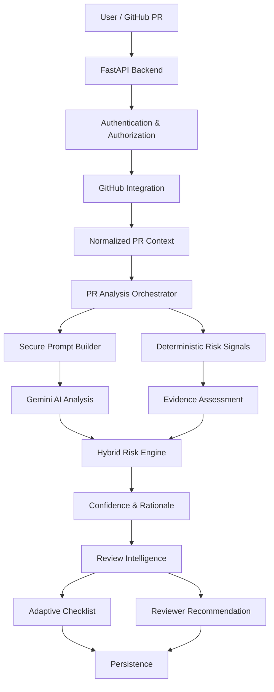

# GitReview AI – Chrome Extension for AI-Powered Pull Request Review Assistance

## Overview

GitReview AI is an AI-assisted pull-request review platform designed to help developers identify PR risk, understand the reasoning behind the assessment, and obtain actionable review guidance.

The current repository contains the implemented backend and AI analysis pipeline. The Chrome Extension/frontend and GitHub Actions integration are the next development stages and are currently in development.

## Problem Statement

Traditional PR review workflows can require reviewers to manually inspect large diffs, identify risky changes, determine appropriate reviewers, and construct review checklists.

GitReview AI aims to assist this workflow through a combination of:

* GitHub PR context
* deterministic code signals
* semantic AI analysis
* explainable risk assessment
* review intelligence

## Objectives

1. Context-Aware PR Integration
2. Secure Semantic PR Processing
3. Hybrid Explainable Risk Assessment
4. Actionable Review Intelligence

## Key Implemented Capabilities

### GitHub Integration

* GitHub authentication
* repository authorization
* pull-request retrieval
* PR analysis workflow

### AI Analysis

* Gemini-based semantic analysis
* secure prompt construction
* validated AI output
* retry/validation behavior

### Deterministic Analysis

* Sensitive path detection and pattern matching
* Code ownership and test coverage signals
* Deterministic rule-based exclusions

### Hybrid Risk Assessment

Deterministic evidence and AI analysis are combined to produce a unified risk assessment. The system incorporates an evidence-based risk-tier behavior to categorize the pull request risk levels.

### Explainability

The system provides concrete rationale and evidence for its risk assessments, extracting context rather than only returning a risk label.

### Confidence

Confidence calculation is implemented using a hybrid scoring mechanism with a cold-start cap, evaluating the breadth of evidence available.

### Review Intelligence

* Reviewer recommendation (CODEOWNERS-weighted ranking, abstain-on-insufficient-evidence)
* Adaptive checklist (deterministic rules combined with AI signals)

### Backend API

* `GET /api/auth/login`
* `GET /api/auth/callback`
* `POST /api/auth/logout`
* `GET /api/auth/me`
* `GET /api/repositories`
* `POST /api/repositories/authorize`
* `DELETE /api/repositories/{repository_id}/access`
* `GET /api/repositories/{repository_id}/pulls`
* `GET /api/repositories/{repository_id}/pulls/{pull_number}`
* `POST /api/repositories/{repository_id}/pulls/{pull_number}/analyze`
* `GET /health`

## Architecture



## Technology Stack

### Backend

* Python
* FastAPI
* SQLAlchemy
* PostgreSQL

### AI

* Google Gemini
* AI provider abstraction/interface
* structured/validated AI output (Pydantic)

### Integration

* GitHub API
* GitHub OAuth

### Testing / Quality

* Pytest
* Ruff

## Project Structure

```text
backend/
├── app/
│   ├── api/
│   ├── auth/
│   ├── ai_provider/
│   ├── analysis/
│   ├── core/
│   ├── github_integration/
│   ├── pull_requests/
│   └── repositories/
├── tests/
├── migrations/
├── PROJECT_STATE.md
├── pyproject.toml
├── alembic.ini
└── .env.example
```

## Current Status

> **Backend implementation completed. The frontend/Chrome Extension and GitHub Actions integration are currently under development.**
>
> The current repository contains the implemented and tested FastAPI backend, GitHub integration, authentication and authorization layers, Gemini-based semantic PR analysis, deterministic code-analysis signals, hybrid risk assessment, explainable rationale, confidence scoring, reviewer recommendation, adaptive checklist, feedback API, confidence calibration, and core REST API workflows.
>
> The complete product is still under active development.

## Roadmap

### Completed
- [x] Backend architecture
- [x] Database foundation
- [x] Authentication and GitHub OAuth
- [x] Repository authorization
- [x] Pull-request integration
- [x] AI provider abstraction
- [x] Gemini integration
- [x] Secure prompt processing
- [x] Deterministic risk signals
- [x] Hybrid risk assessment
- [x] Confidence scoring
- [x] Reviewer recommendation
- [x] Adaptive checklist
- [x] Feedback API
- [x] Confidence calibration
- [x] Core REST API workflows
- [x] Backend testing and quality verification

### In Development / Planned
- [ ] Chrome Extension UI
- [ ] GitHub Actions integration
- [ ] End-to-end integration testing
- [ ] Production deployment
- [ ] Analytics dashboard

## Testing

- Unit and API tests: 292/292 passing
- Ruff: PASS

## Security

* Authenticated API access via secure session tokens
* Strict repository authorization and user-scoped resources validation
* Secure prompt handling and input validation
* Secret exclusion from source control
* Environment-based credentials management
